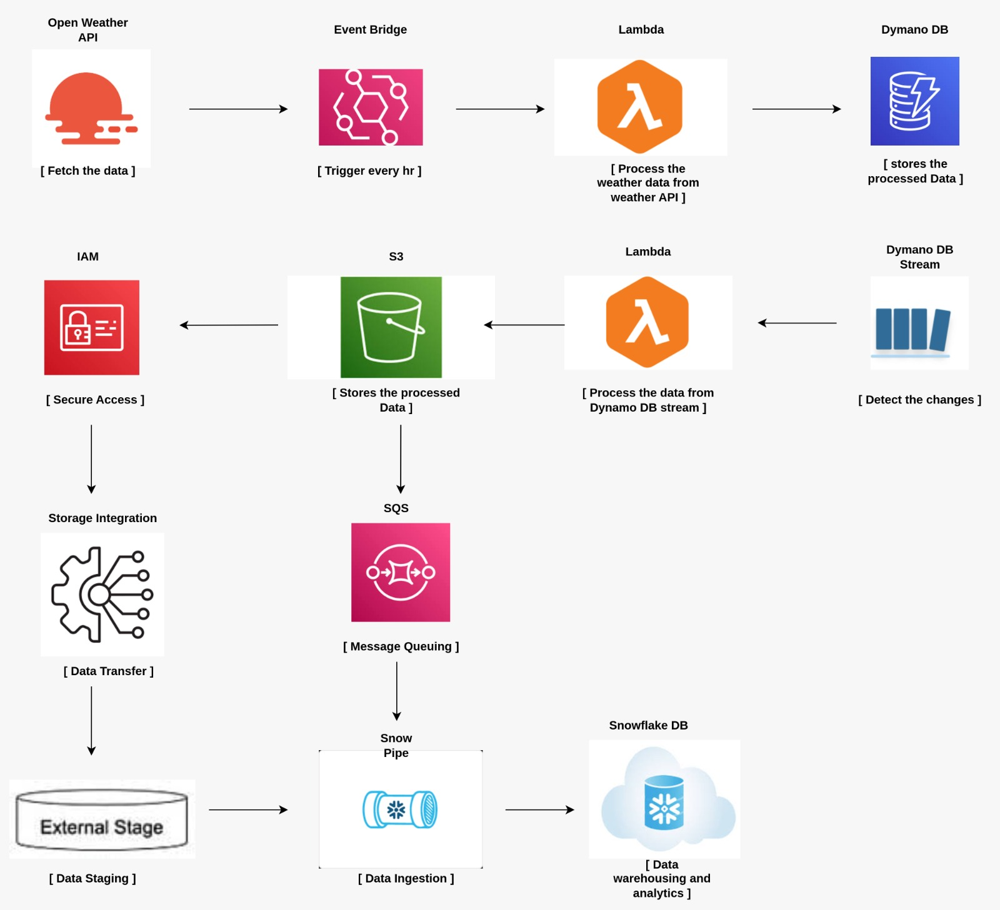

# Real_time_weatherdata_Pipeline
---
This project showcases a fully automated data pipeline using the powers of AWS like Eventbridge, Lambda, Dynamo DB, S3 and Snowflake. It entails designing and implementing a real-time weather data pipeline to process and analyse the weather updates. The objective is to enable predictive insights for weather pattern.

-** The ** starting point of this task is to create a weather api to collect real-time weather data including city name, temperature, weather and timestamp of taregetd location. API keys are used to securely access the OpenWeather API.

-**An event bridge rule is initiated to trigger the lambda function every hour automating the periodic data collection process.

The triggered Lambda function processes the raw weather data from the API and transforms it into a structured format.The processed data is stored in DynamoDB. This step ensures real-time data storage and easy access.

Dynamo DB stream tracks the changes in the table.

Once the data in added, modified or deleted from the table the Dynamo DB stream detect it and logged in real time. 

They trigger the next lambda function to archive the modified data into s3 bucket.

Storage integration Securely connects S3 with Snowflake for seamless and efficient data transfer.

In the process s3 serves as an external stage for snowflake  providing a staging area for data ingestion.

For the automatic and continuous ingestion of data from s3 to snowflake table we created a snowpipe which is triggerd by the SQS queue. 

Fianlly  The pipeline calculates the average temperature and generates weather forecasts for each city, enabling predictive insights.

#               Real-Time Weather Data Pipeline

This project demonstrates a fully automated data pipeline leveraging AWS services such as EventBridge, Lambda, DynamoDB, S3, and Snowflake. The pipeline is designed to collect, process, and analyze real-time weather data, enabling predictive insights into weather patterns. The architecture ensures seamless data flow, efficient processing, and robust analytics.

## Architecture Overview

### Step 1: Data Collection

- **OpenWeather API**: The pipeline begins by fetching real-time weather data, including city name, temperature, weather conditions, and timestamps for targeted locations. API keys are used to securely access the OpenWeather API.

### Step 2: Event Scheduling

- **AWS EventBridge**: An EventBridge rule triggers a Lambda function every hour, automating the periodic data collection process.

### Step 3: Data Processing and Storage

- **Lambda Function**: The triggered Lambda function processes the raw weather data from the API and transforms it into a structured format.
- **DynamoDB**: The processed data is stored in DynamoDB, a scalable and fast NoSQL database. This step ensures real-time data storage and easy access.

### Step 4: Change Detection

- **DynamoDB Streams**: DynamoDB Streams monitor changes to the table, such as data insertions, updates, or deletions. These changes are detected and logged in real time.

### Step 5: Archiving Processed Data

- **Triggering a Second Lambda Function**: When a change is detected, a second Lambda function is triggered to archive the modified data into an S3 bucket.
- **S3 Bucket**: S3 serves as a durable and cost-effective storage solution for processed weather data.

### Step 6: Data Integration and Transfer

- **Storage Integration**: Secure integration is established between S3 and Snowflake to facilitate seamless data transfer.
- **S3 as External Stage**: In this architecture, S3 acts as an external stage for Snowflake, providing a staging area for data ingestion.

### Step 7: Automated Data Ingestion

- **Snowpipe**: Snowpipe is configured for automatic and continuous ingestion of data from the S3 bucket into a Snowflake table. This process is triggered by an SQS queue to ensure smooth and reliable ingestion.

### Step 8: Analytics and Insights

- **Snowflake**: The ingested data is stored in Snowflake for advanced analytics. The pipeline calculates the average temperature and generates weather forecasts for each city, enabling predictive insights.

## Key Features

- **Fully Automated Workflow**: Hourly scheduling and real-time triggers ensure the pipeline operates without manual intervention.
- **Scalable Architecture**: AWS and Snowflake services provide the scalability needed to handle large volumes of weather data.
- **Predictive Analytics**: The pipeline delivers actionable insights, such as weather forecasts and average temperature calculations, to support decision-making.

This architecture exemplifies a modern, cloud-based approach to real-time data processing and analytics, providing a robust solution for weather data management.

