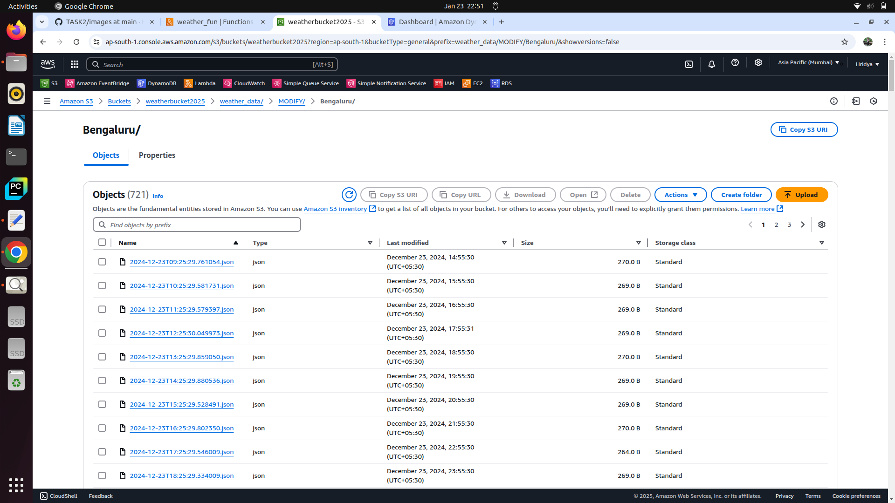

# Real_time_weatherdata_Pipeline
---
This project showcases a fully automated data pipeline using the powers of AWS like Eventbridge, Lambda, Dynamo DB, S3 and Snowflake. It entails designing and implementing a real-time weather data pipeline to process and analyse the weather updates. The objective is to enable predictive insights for weather pattern.

-**The starting point of this task is to create a weather api to collect real-time weather data including city name, temperature, weather and timestamp of taregetd location. API keys are used to securely access the OpenWeather API.

-**An event bridge rule is initiated to trigger the lambda function every hour automating the periodic data collection process.

The triggered Lambda function processes the raw weather data from the API and transforms it into a structured format.The processed data is stored in DynamoDB. This step ensures real-time data storage and easy access.

Dynamo DB stream tracks the changes in the table.

Once the data in added, modified or deleted from the table the Dynamo DB stream detect it and logged in real time. 

They trigger the next lambda function to archive the modified data into s3 bucket.

Storage integration Securely connects S3 with Snowflake for seamless and efficient data transfer.

In the process s3 serves as an external stage for snowflake  providing a staging area for data ingestion.

For the automatic and continuous ingestion of data from s3 to snowflake table we created a snowpipe which is triggerd by the SQS queue. 

Fianlly  The pipeline calculates the average temperature and generates weather forecasts for each city, enabling predictive insights.

